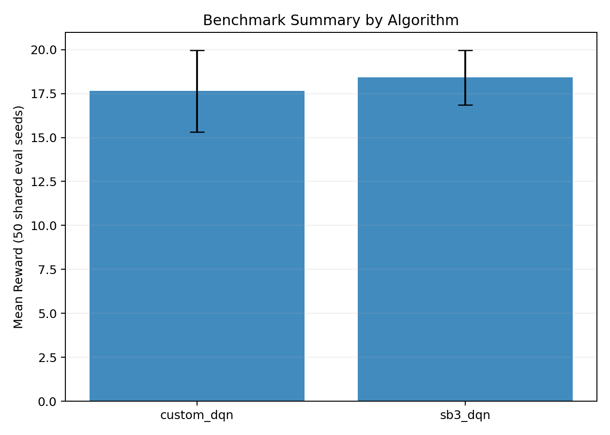
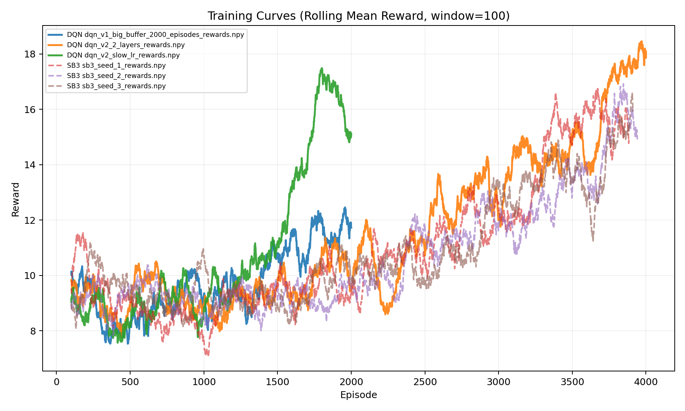

# Resume Du Benchmark

## Protocole
- Environnement: `highway-v0`
- Seeds d'evaluation partagees: `100..149`
- Nombre d'episodes d'evaluation par modele: `50`
- Hash de configuration (reproductibilite): `b1f97473cf49b8a53d9ce3c2bd3d96b6bf286bfa155888401ebe10d790dba8bb`

### Interpretation Du Protocole
- Meme configuration pour tous les modeles: comparaison equitable.
- Memes seeds d'evaluation: variance aleatoire controlee.
- Hash fourni: preuve de configuration stable.

## Visualisations

### Comparaison Finale (Reward)

- Lecture: compare la reward moyenne agregée entre methodes.

### Courbes D'entrainement

- Lecture: dynamique de convergence et stabilite des runs.

## Resultats Agreges
| algorithme | reward_moyenne | ecart_type_reward | crash_rate_moyen_pct | nb_modeles |
| --- | --- | --- | --- | --- |
| custom_dqn | 17.64266162870695 | 2.3333557120630277 | 41.333333333333336 | 3 |
| sb3_dqn | 18.4234124435779 | 1.5554159852695086 | 76.66666666666667 | 3 |

### Interpretation Des Resultats Agreges
- `reward_moyenne`: performance brute moyenne.
- `crash_rate_moyen_pct`: indicateur securite (plus bas = mieux).
- `ecart_type_reward`: variabilite entre modeles d'une meme methode.

## Resultats Par Modele
| algorithme | modele | chemin | n_eval | reward_moyenne | reward_std | longueur_moyenne | longueur_std | crash_rate_pct | nb_crash | seeds_echec_apercu |
| --- | --- | --- | --- | --- | --- | --- | --- | --- | --- | --- |
| custom_dqn | dqn_v1_big_buffer_2000_episodes_last.pth | results/dqn/dqn_v1_big_buffer_2000_episodes_last.pth | 50 | 17.721299998870197 | 7.19345242377722 | 22.62 | 9.522373653664301 | 40.0 | 20 | 102,104,105,108,111,112,113,117,124,125 |
| custom_dqn | dqn_v2_2_layers_last.pth | results/dqn/dqn_v2_2_layers_last.pth | 50 | 19.935704097415474 | 3.725536792573459 | 27.8 | 5.596427431853289 | 14.000000000000002 | 7 | 114,123,125,131,143,148,149 |
| custom_dqn | dqn_v2_slow_lr_last.pth | results/dqn/dqn_v2_slow_lr_last.pth | 50 | 15.270980789835182 | 6.346037087725945 | 19.58 | 8.590902164499372 | 70.0 | 35 | 100,101,102,107,108,109,111,112,113,114 |
| sb3_dqn | sb3_seed_1_last.zip | results/sb3/sb3_seed_1_last.zip | 50 | 20.126932840184512 | 8.581400530522426 | 21.46 | 8.651496980291908 | 66.0 | 33 | 101,103,104,105,106,108,110,111,112,115 |
| sb3_dqn | sb3_seed_2_last.zip | results/sb3/sb3_seed_2_last.zip | 50 | 17.07887178605279 | 9.04316239351216 | 18.1 | 8.962700485902673 | 84.0 | 42 | 100,101,102,104,105,106,107,108,110,111 |
| sb3_dqn | sb3_seed_3_last.zip | results/sb3/sb3_seed_3_last.zip | 50 | 18.06443270449639 | 8.37307681181434 | 19.06 | 8.080618788186955 | 80.0 | 40 | 101,103,104,105,106,108,109,110,111,112 |

### Interpretation Par Modele
- Permet d'identifier le meilleur checkpoint et les cas instables.
- `seeds_echec_apercu` liste des seeds a rejouer pour analyse d'echec.

## Notes De Reproductibilite
- Meme configuration environnementale pour toutes les evaluations.
- Meme liste de seeds deterministes pour tous les modeles.
- Metadonnees completes dans `benchmark_metadata.json`.